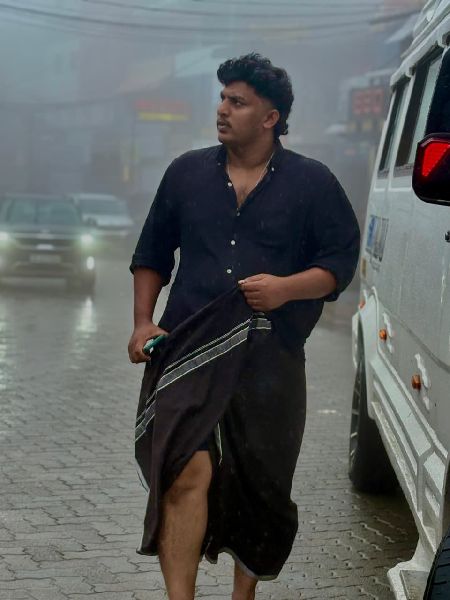

# @Odikka_ — landing page

A single responsive page. No build step, no dependencies to install: open
`index.html` in a browser, or serve the folder.

```
npx http-server -p 4321 -c-1
```

## Files

| File | What's in it |
| --- | --- |
| `index.html` | All the content. Every placeholder is marked with a `PLACEHOLDER` comment. |
| `styles.css` | Design tokens at the top, mobile-first rules, desktop overrides at the bottom. |
| `main.js` | The scroll animation. The `WAVE` table controls how each member moves. |
| `assets/odikka-dp.jpg` | Group profile picture — the original 1080×1080 file, copied without re-encoding. |
| `assets/members/*.jpeg` | The eight member photos, also byte-for-byte copies of the originals. |

## Swapping in the real stuff

**Links.** Live. Both appear twice, in the hero and again in the footer, so change
all four if either ever moves:

- WhatsApp — `https://chat.whatsapp.com/Kn5nX6UVa0AAOz2hNa269N`
- Instagram — `https://www.instagram.com/odiikka__/`

Both open in a new tab, so someone who taps WhatsApp still has the page behind
them to go back and tap Instagram.

**Order.** The members appear in DOM order, and that is the order they rise in.
`data-lane` alternates `left`/`right` down the list — keep it alternating when you
reorder, or two in a row will drift up the same side. The `WAVE` rows in `main.js`
are positional, not per-person: row 1 always describes whoever is first in the
HTML, so reordering the markup means updating only the name comments.

**Callouts.** Each member is one `<article class="floater">` block: `.bubble__text`
is the line, `.bubble__meta` is the timestamp under it. The lines are real; the
times are still invented, so change those if you want them to mean something.

Malayalam lines carry `lang="ml"`. Keep that on any line that is mostly Malayalam
and leave it off for one that is entirely English — it tells the browser which
script to shape and screen readers which language to speak.

The callouts are set in **Baloo Chettan 2**, which covers both Malayalam and Latin,
so a bubble that mixes the two still reads as one voice. None of the other fonts
on the page contain Malayalam glyphs, so if you ever change `--speech` in
`styles.css`, pick something that does or the text will fall back to whatever the
visitor's device happens to have.

Aim for lines that fit in three or fewer wrapped lines on a phone — roughly 35
Malayalam characters. `text-wrap: balance` evens out how they break.

**Which side they float up on.** `data-lane="left"` or `data-lane="right"` on the
`.floater`. Alternating reads best.

**Adding or removing a member.** The `WAVE` array in `main.js` must have exactly
one row per `.floater`, in the same order as the HTML. Copy a row and respace the
`delay` values evenly — see "How the animation works" below for what they mean.

## Member photos and the circular crop

The photos are candid shots, not headshots, so a plain centred crop would land on
someone's shirt. Rather than re-cutting the files, each photo is positioned inside
its circle by three custom properties set inline in the markup:

```html
<div class="floater__pic">
  
</div>
```

- `--pw` — how wide the photo is drawn, as a percentage of the circle. `300%`
  means it is three times the circle's width, i.e. zoomed in 3×.
- `--pl` / `--pt` — where the photo's top-left corner sits, also as a percentage
  of the circle. Both are usually negative, pulling the photo up and left so the
  face lands in the middle.
- `--ph` — use instead of `--pw` when the photo is sideways and gets rotated.
- `--rot` — rotation for a photo shot sideways. Santhosh's is `90deg`; none of
  these files carry EXIF orientation, so the browser will not fix it for you.

To fit a new photo, start with `--pw: 250%` and nudge `--pl` and `--pt` until the
face is centred. Two rules keep the circle from showing a bare edge: `--pl` must
be between `100% - --pw` and `0`, and the same for `--pt` against the photo's
scaled height.

The files themselves are untouched originals, between 720 and 1600px on the short
side — far more than the ~104px the circles ever render at, so they stay sharp on
any screen. That does mean about 1.3 MB of photos on first load. If you ever want
that lighter, resizing them to 600×600 would cut it to roughly a tenth with no
visible difference at this size.

## How the animation works

`ScrollTrigger` pins the roll-call section and scrubs a single number from 0 to 1.
`render()` turns that number into a position for each member:

- `delay` — where in the scroll they start rising
- `amp` — how far they sway sideways, in pixels
- `freq` — how many half-waves of sway they make on the way up
- `phase` — where in the wave they begin, so no two sway together
- `tilt` — how far they rotate at the extremes of the sway
- `lift` — their rise distance, so they don't all travel at one speed

The first member's `delay` is **negative** on purpose. It means he is already a
quarter of the way up when the section arrives, so the screen is never empty.
Everyone after him starts below the fold. The delays are spaced `0.10` apart, and
the last one is `0.60` so that he finishes exactly at the end of the section —
`SPAN` is derived from that last value, so respacing the delays is all you need
to do when the number of members changes.

Only `transform` and `opacity` are ever written, through GSAP `quickSetter`s, so
nothing triggers layout. Measured under 4× CPU throttling at 390px wide with all
eight photos, frame deltas held at a 16.8 ms median with a 19.3 ms worst case —
no dropped frames.

There is deliberately no smooth-scroll library. Native scroll is what touch
devices expect, and hijacking it is what makes these pages feel janky on a phone.

## Fallbacks

The page works without the animation. If GSAP fails to load, JavaScript is off,
or the visitor has "reduce motion" turned on, the roll call renders as a plain
readable stack and the ambient loops (typing dots, ticker) stop. The animated
layout is only switched on by the `is-animated` class, which `main.js` adds.

## Section length

How long the pinned section runs is set in `styles.css`:

```css
.roast.is-animated{ height: calc(var(--stage-h) * 4.2); }   /* mobile */
.roast.is-animated{ height: calc(var(--stage-h) * 4.8); }   /* ≥40rem */
```

Bigger multiplier means a slower, longer drift.
